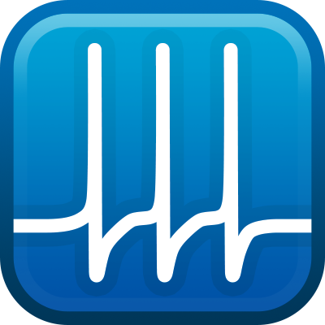

<h1>Simple, Powerful, Extensible 
Protocol-Driven Acquisition in MATLAB</h1>

  <a href="{{ site.github.repo }}/releases/download/{{ site.version }}/Symphony.mlappinstall" class="btn">Download</a>
  <a href="{{ site.github.repo }}" class="btn">GitHub</a>

## What is Symphony?
Symphony is a MATLAB-based data acquisition system for electrophysiologists. It provides a framework for writing acquisition routines and a user interface to conduct experiments.

## Protocol-Driven Acquisition
Symphony is centered around protocol-driven acquisition. Protocols are acquisition routines you write in MATLAB using the Symphony framework.

## Built-in Data Manager
Symphony includes a built-in data manager for browsing, viewing, and annotating data during experiments.

## Flexible Metadata System
Symphony includes a flexible metadata definition and collection system.

## Modular and Extensible

## Device-Agnostic Programming Interface

## Free and Open Source
