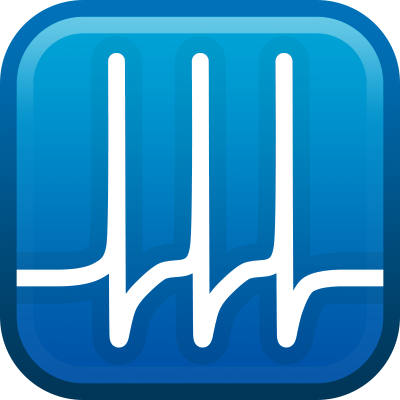

<h1>Simple, Powerful, Extensible 
Protocol-Driven Acquisition in MATLAB&reg;</h1>

  <a href="{{ site.github.repo }}/releases/download/{{ site.version }}/Symphony.mlappinstall" class="btn">Download</a>
  <a href="{{ site.github.repo }}" class="btn">GitHub</a>

## What is Symphony?
Symphony is a MATLAB based data acquisition system for electrophysiologists. It provides a framework for writing acquisition routines and a user interface to conduct experiments.

## Protocol-Driven Acquisition
Symphony is centered around protocol-driven acquisition. Protocols are high-level acquisition routines you write in MATLAB using the Symphony framework. You can write protocols with sophisticated online analysis and gap-free recording.

  <a href="{{ site.github.repo }}/blob/master/src/main/resources/examples/%2Bio/%2Bgithub/%2Bsymphony_das/%2Bprotocols/Pulse.m" class="btn">View an Example Protocol</a>

## Built-in Data Manager
Symphony includes a built-in data manager to browse, view, and annotate data during experiments. You can use the data manager to maintain visibility across the entire experimental timeline.

## Flexible Data Model
Symphony uses a flexible data model that supports a wide variety of organizational approaches. You can write simple descriptions to define the experimental structure and metadata that best suits your needs.

  <a href="{{ site.github.repo }}/blob/master/src/main/resources/examples/%2Bio/%2Bgithub/%2Bsymphony_das/%2Bsources/Subject.m" class="btn">View an Example Description</a>

## Modular and Extensible
Symphony was built from the ground up to be modular and extensible. At the app-level you can write modules to add custom features to the user interface. At the core-level you can write implementations to add support for additional hardware and file formats.

## Device-Agnostic Programming Interface
Symphony abstracts away device-specific details that allow your acquisition routines to be hardware independent. You can share your protocols across experimental rigs with limited or no modification.

## Free and Open Source
Symphony is released under the [MIT License](https://opensource.org/licenses/MIT), which is an [open source license](https://opensource.org/docs/osd). You can share and change the source code to your heart's content!

&copy; {{ site.time | date: '%Y' }} Symphony-DAS. MATLAB is a registered trademark of The MathWorks, Inc. The OSI logo trademark is the trademark of Open Source Initiative.
